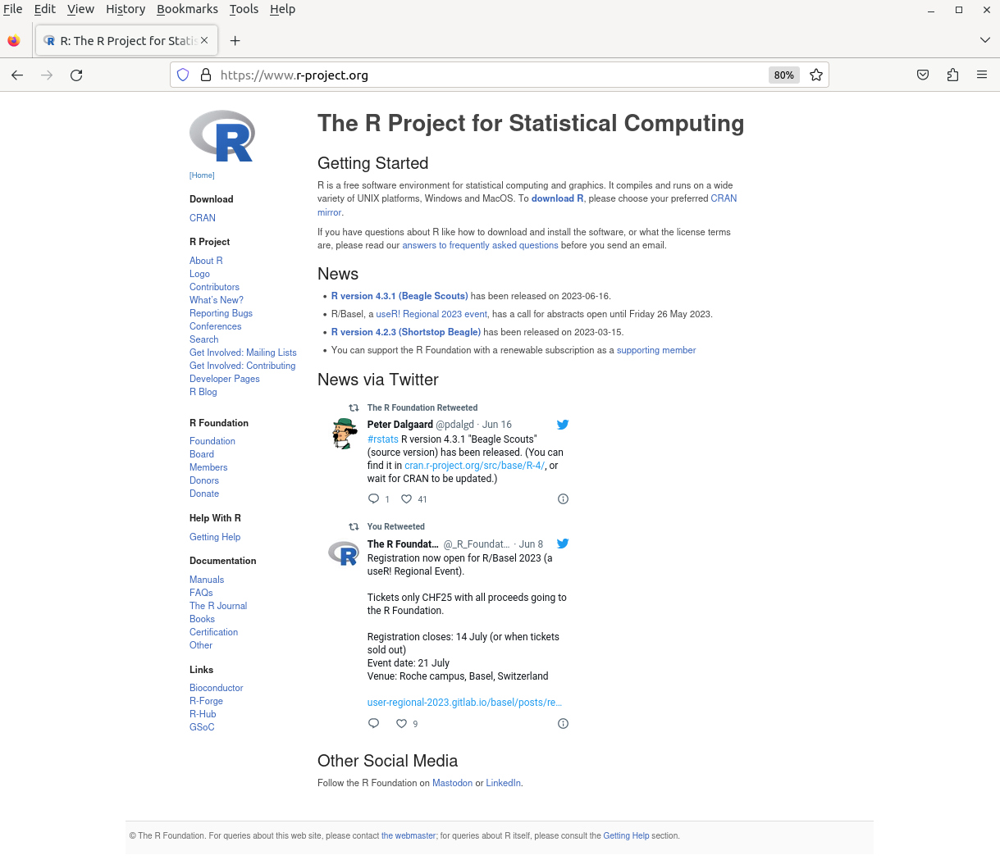

## What is this about?

The [R Project](https://www.r-project.org/) has its main web page at [www.r-project.org](https://www.r-project.org/).
The page provides a navigation bar the left, along with a (manually updated) 'News' section as well a widget displaying recent [tweets from R Foundation](https://twitter.com/_R_Foundation) along with links to two more social media accounts.

{ width=95% }

Above it is a brief main section title **Getting Started**.
We are hoping we can make that segment more be expressive, inviting and actionable.

## What is proposed?

The current text is provided [in this file](md/index.md) as a copy of the [master file](https://github.com/r-devel/r-project-web/blob/master/md/index.md) from the [github mirror of the main svn site](https://github.com/r-devel/r-project-web).
We can ignore everything below **News** and focus on the main two paragraphs.
New content can be proposed in the standard way via a pull request.
We expect that over time a set of contributors may emerge to review and polish suggestion.
The ultimate plan is the have the page (or portion of the page) be mirrored back to the main website.

## What is out of scope?

Everything else :)
Let us try to _not_ get into auxiliary discussions about fonts, colours, css, web frameworks and an infinite number of other topics all of which will dilute this effort.
Our aim is to make the first two paragraphs _count_ and be _actionable_ and _inviting_.

## Who started this?

Following discussions on the monthly R Foundation conference call, [Dirk Eddelbuettel](https://github.com/eddelbuettel) volunteered to drive this.
The help of [Jeroen Ooms](https://github.com/jeroen), [Gergely Daróczi](https://github.com/daroczig), and [Lluís Revilla](https://github.com/llrs) in getting it under the umbrella of the [r-devel](https://github.com/orgs/r-devel/) GitHub organization is appreciated too.
